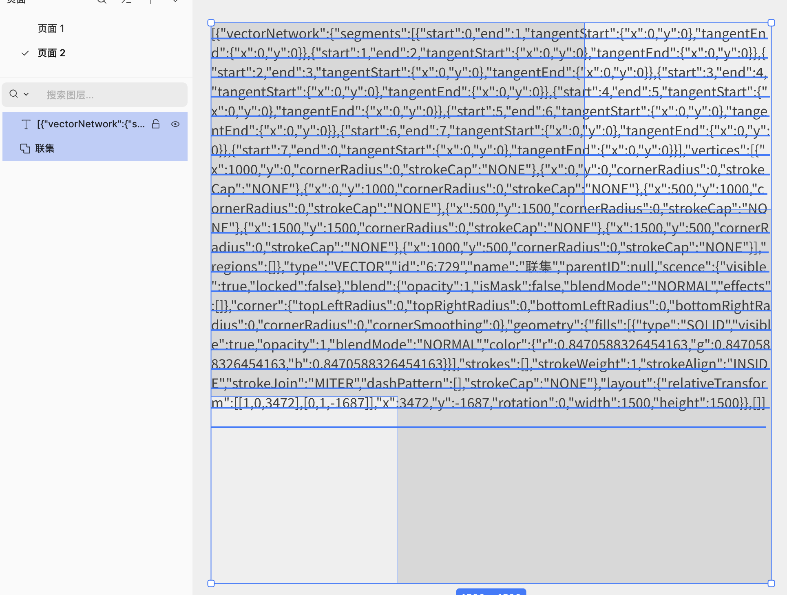
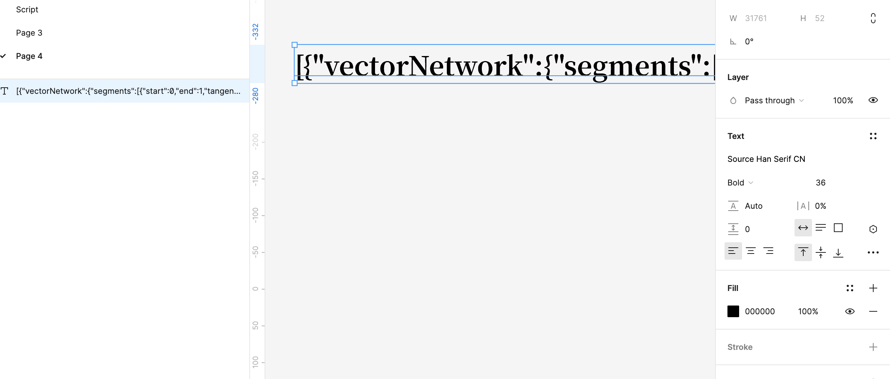
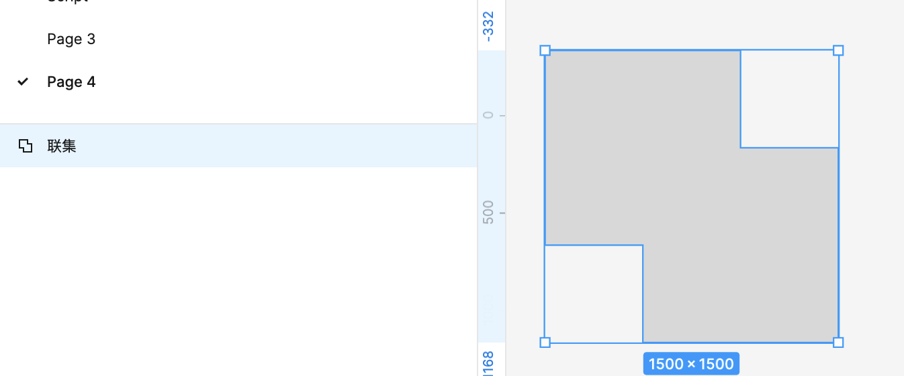
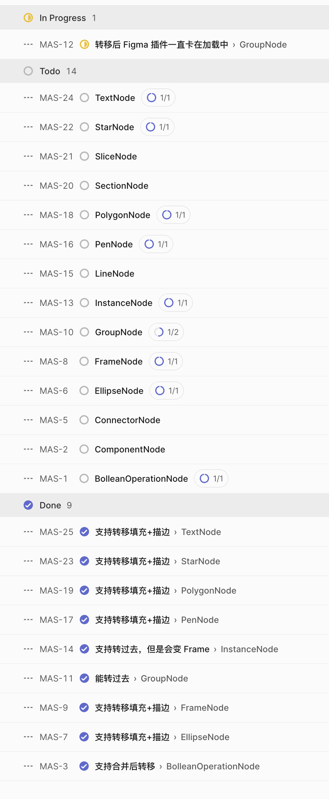

# MasterGo2Figma

截止 2026-04-17，把之前的计划发给 AI，现在实现的差不多了。

---

​	最近要把设计稿都从 MasterGo 转去 Figma 了，MasterGo 很多功能没有。

​	之前的设计稿转移起来还挺麻烦的，的确可以从 MasterGo 导出 Sketch 然后在 Figma 导入，但是效果太差了啊。

​	所以写了这么一个插件，虽然还有很多东西不支持转移，慢慢来吧。

​	也希望有空的全栈设计师帮忙写一点，我不常上 Github，但是提交的代码我一定会看的

## 用法

​	Basically，我在 MasterGo 里通过插件把图层属性变成 Json 文本节点，然后导出 Sketch，再在 Figma 里导入 Sketch，最后用对应的插件还原。

​	所以要在 MasterGo 里装上插件 SendToFigma ，然后到 Figma 转上插件 ReceiveFromMasterGo。
​	在 MasterGo 里选中一个图层，比如一个“联集”，也就是布尔图层。然后运行插件，会得到一个文本图层。

​	不用看懂。这个文本节点会随着 Sketch 导出/导入一起带到 Figma 里。

然后运行 ReceiveFromMasterGo 插件，神奇的事情就发生了。

名字，填充，描边什么的都会还原。

## 当前未实现 / 下一迭代

以下能力在当前迭代会被降级或暂不恢复，后续再继续补：

- 组件集、组件、实例不会恢复为真实 Figma 组件关系，当前只按视觉等价恢复为普通画框/容器。
- Variant 属性、Component Properties、Instance mainComponent/swap/override 暂不恢复。
- BooleanOperation 不保留源矩形/圆形子节点，只恢复压平后的视觉结果。
- 图片填充仍受限于当前 imageHash/资源迁移能力。
- 多段混排文本样式、文字局部样式、超链接、list style 暂不完整恢复。

## 进度

https://linear.app/comicandmanga/team/MAS/active  (不知道陌生人能不能看)
总之目前是这个进度：

估计后面没什么时间写，不用对这个项目抱有太大期望。
