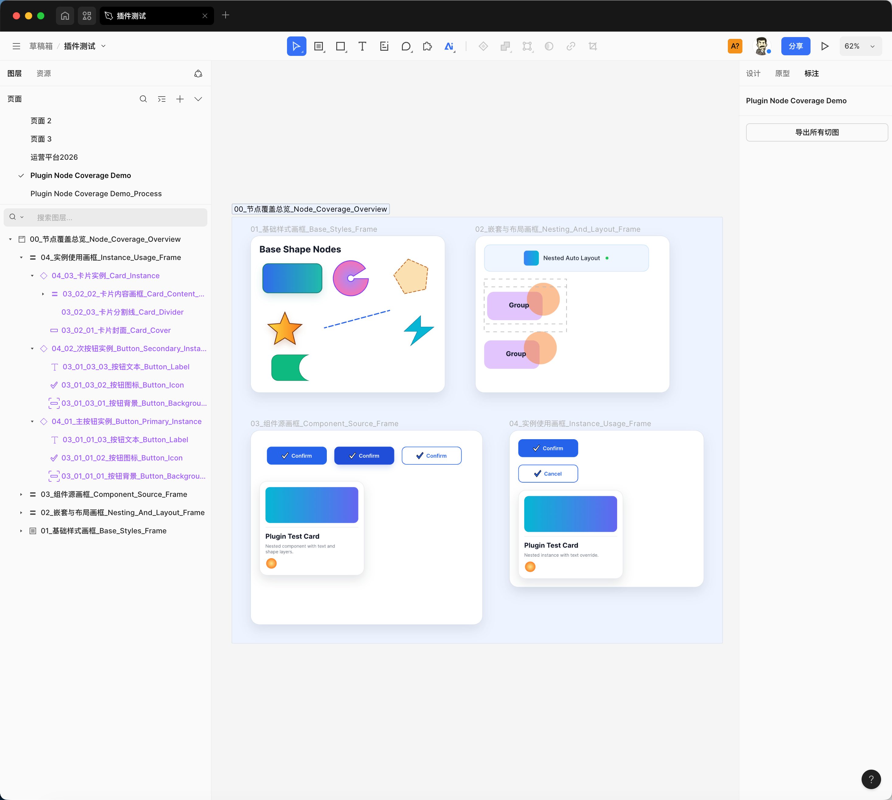
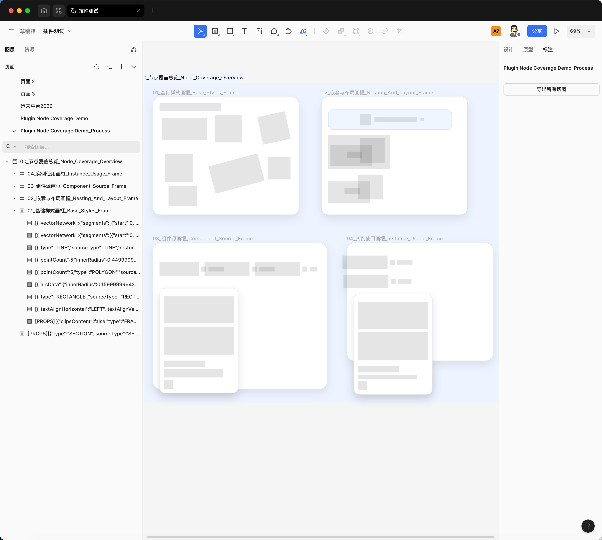
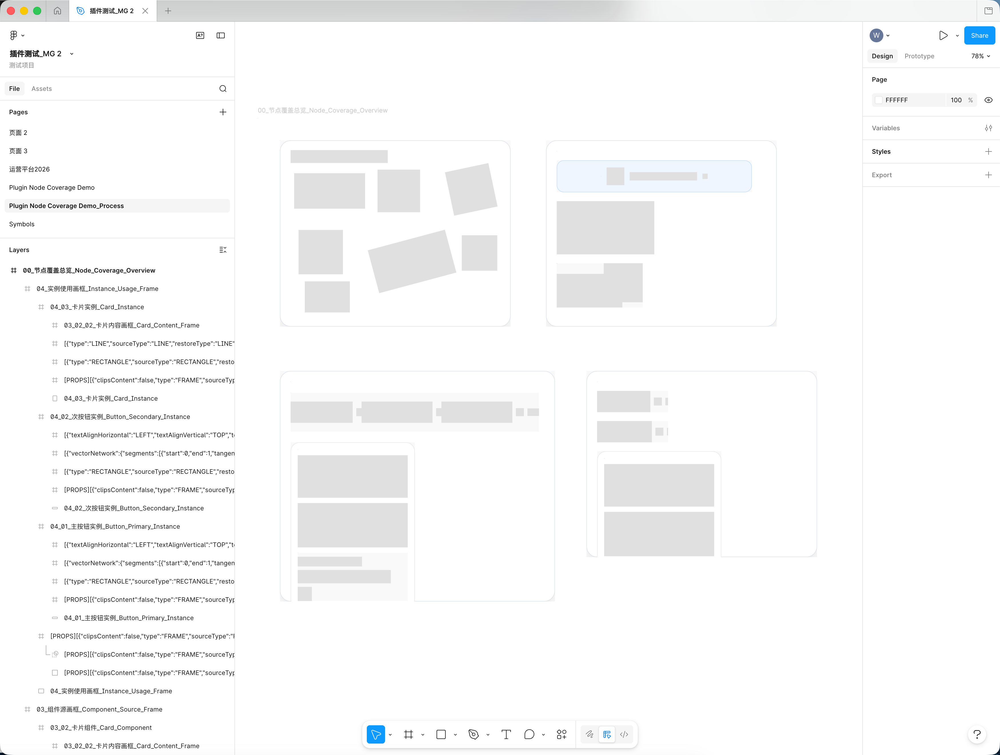
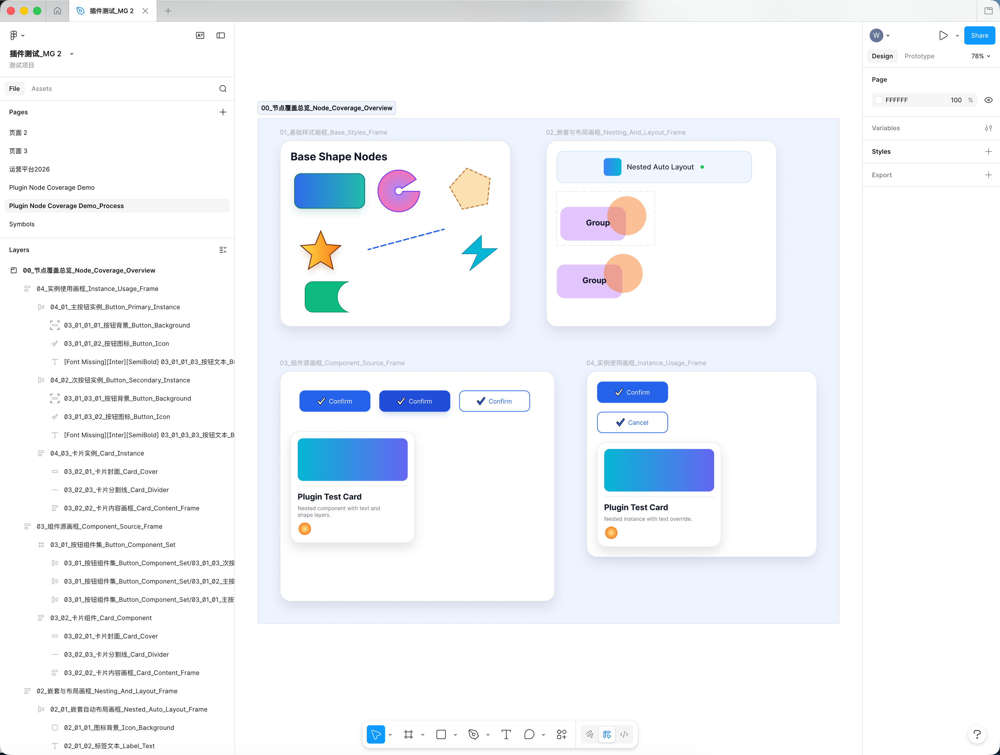
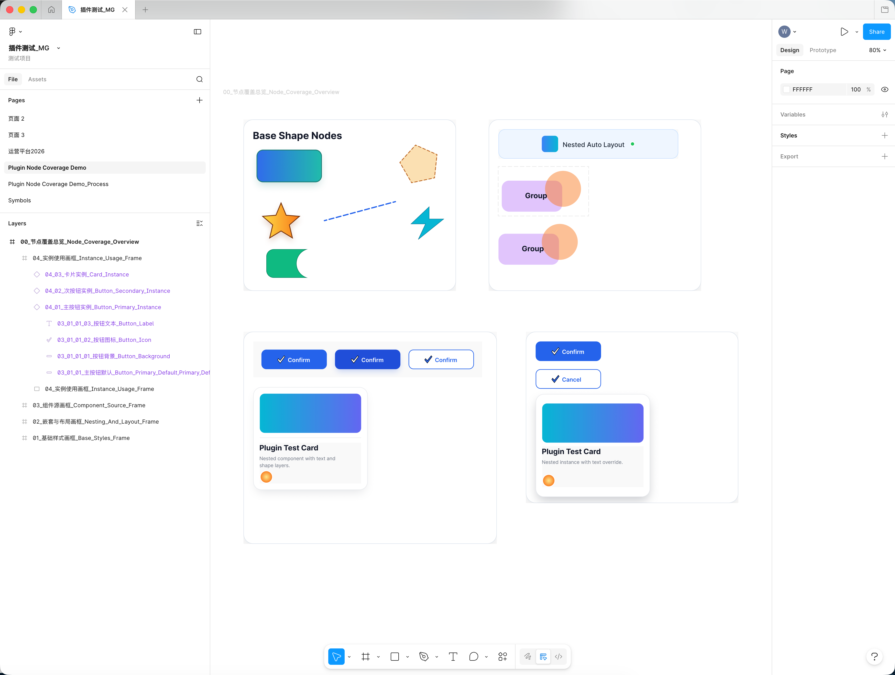

# MasterGo2Figma

最近要把设计稿都从 MasterGo 转去 Figma 了，MasterGo 很多功能没有。

之前的设计稿转移起来还挺麻烦的，的确可以从 MasterGo 导出 Sketch 然后在 Figma 导入，但是效果太差了啊。

所以写了这么一个插件，虽然还有很多东西不支持转移，慢慢来吧。

也希望有空的全栈设计师帮忙写一点，我不常上 Github，但是提交的代码我一定会看的

## 更新日志

### 20260427

1. 之前的思路是将 MasterGo 里的每个图层都变成 Text 然后存到 TextNode 里，但是后来发现一个 TextNode 如果内容过多页面就奔溃了。所幸发现目前图层的名称长度没有限制，所以就改成了转成 Frame 放在图层名字里。

所以你现在看到转换后的图层会是一堆 Frame，我还特地将 fill 变成 10% 的黑，这样看着能看清结构。

2. 以防万一我还是加了 Menu，让用户可以只转选中的、转当前 Page 的、转全部。避免一下子转太多结果 MG 卡死。

**还没做的**

- 组件、组件集、实例在当前版本会按视觉等价降级为普通 Frame/容器恢复，暂不恢复真实组件关系。

## 用法

整体流程还是借 Sketch 作为中转格式，同时考虑到插件上架可能有些难度而且还未完成，你需要手动在 MG 和 Figma 中导入插件。

然后是用法：

1. 在 MasterGo 安装并运行 `SendToFigma` 插件。
2. 插件会把图层属性写入一个临时 Frame 中。这个 Frame 使用 10% 黑色填充，图层名称里保存原图层的 JSON 数据。
3. 从 MasterGo 导出 Sketch 文件。
4. 在 Figma 中导入这个 Sketch 文件。
5. 在 Figma 安装并运行 `ReceiveFromMasterGo` 插件，把临时 Frame 还原成真实图层。

在 MasterGo 里可以选择三种转换方式：

- `仅转换当页`：转换当前页面。
- `转换所有页面`：批量转换文件内所有页面。
- `仅转换已选中`：只转换当前选中的顶层图层。

### 举例：

这是原来的：

转换后的图层后面会加上"_Processed"新生成一个 Page。同时差不多长这样：

可以看到所有需要转换的图层都变成了 Frame，然后属性则用图层名称承载了。

接下来将这个文件导出 Sketch，然后导入 Figma，因为只是简单的 Frame，Sketch 和 Figma 也未对图层名称做长度限制，所以可以预想到的是所有的信息都会被原封不动地保留到 Figma 中，长这样：

其实只需要 _Process 这个 Page 就可以了。接下来使用 ReceiveFromMasterGo 插件，将这一页还原成 Figma。插件会读取放在图层名称中的 json 代码，然后逐个属性还原。

最后效果是这样：

还原效果会比 Sketch 还原好一些，毕竟后者经过了两层转换。

更重要的是可控了，再碰到什么问题，可以调整转换规则来解决。

