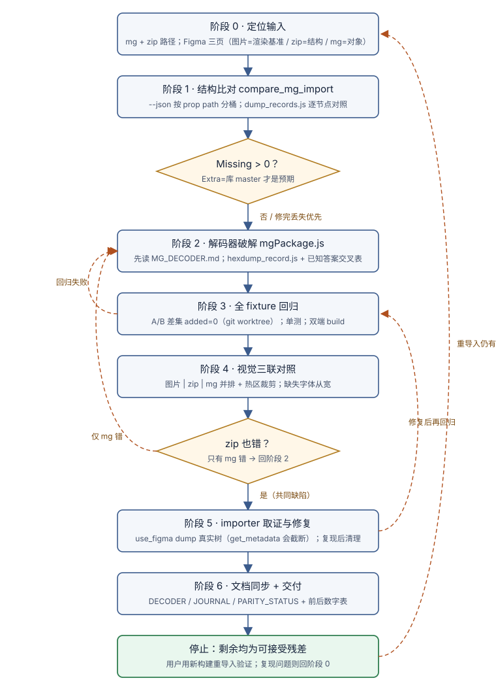

# AW MG Import Parity

修复当前 MasterGo2Figma 仓库的 `.mg` 导入保真度。开始时从当前工作目录或 Git 上下文解析仓库根目录；不得依赖某台机器上的固定绝对路径。

执行时先读取 [MG 导入保真度修复文本工作流](docs/workflow.md)。

三个证据源各司其职，混用会误诊：

- **图片页（截图导入）= 渲染基准**。MasterGo 自己导出的 PNG，是"屏幕上应该长什么样"的唯一真相。
- **zip = 结构基准**。SendToFigma 导出的 v2 包，是"插件 API 说了什么"——它对 importer 的 bug 全盲，
  且个别字段（径向渐变比例、crop 窗口）本身有已知损耗，不是绝对真相。
- **mg 导入 = 修复对象**。目标：先追平 zip（结构），再追平图片（渲染）。



## 阶段 0 · 定位输入

1. 确认 `.mg` 与基准 zip 的路径（通常在 `测试集/<名称>/` 下成对出现）。
2. 从 Figma 链接找到三个页面：`页面 X_mg`（mg 导入）、`页面 X_zip`（zip 导入）、`页面 X_image`（参考图）。
   `get_metadata` 不带 nodeId 的顶层页列表**可能不全**——拿链接里的 node-id 直接探，或按 canvas id 逐个试。
3. 开始前先读仓库根 `AGENTS.md` 与 `docs/MG_DECODER.md`——改 `mgPackage.js` 前必读是仓库硬规矩，
   逆向手法与踩坑史在 `docs/MG_DECODER_JOURNAL.md`。

## 阶段 1 · 结构比对（mg vs zip）

```bash
cd "$REPO" && node tools/compare_mg_import.js "<file.mg>" "<baseline.zip>"
```

判读规则（每一条都有血泪教训背书）：

- **Missing records 永远不可接受**——哪怕只有几条，背后往往是整棵子树丢失。**Extra** 若全是
  `libraryMaster` 库 master 则是预期噪音（importer 收尾会删）。
- **看 `Deep prop mismatches` 全量，别只看那排具名计数**。加 `--json` 导出后按 prop path 分桶、
  再抽样每桶的具体行——历史上具名计数全零时仍有一整族属性全错。
- 用 `scripts/dump_records.js` 把两侧记录各导成 JSON，逐节点对照（actual = mg 解码，expected = zip）。

## 阶段 2 · 解码器破解（mgPackage.js）

- 定位差异字段后，用 `scripts/hexdump_record.js` 按 `\x01<id>\x00` 锚点 dump 原始记录字节。
- **已知答案交叉表**：把节点按基准期望值分组，与候选字节交叉制表，取值与分组完全对齐的 tag 才算破解；
  单例最值钱（218/18/1 分布里的那个 1 直接去基准里查答案）。
- **顺序步进解析，永不在 twisted-float 载荷里用 tag 正则**；`break`-on-unknown 是静默截断不是保险。
- **区分"字段缺失"与"字段值为 0"**：MasterGo 大量"省略即默认"。
- **放宽正则前先定义新语法的边界**：一个不允许点号的 family 正则曾丢掉 22/27 个字体条目，
  是"mg 明显比 zip 差"的最大单一根因。
- **显示名字段可能有两种身份**（权威拼写 vs 本地化别名），必须拿第二来源（psName）交叉判别。

## 阶段 3 · 回归（每次解码器改动后）

1. 主 fixture 重跑 compare，逐类计数要单调变好。
2. **其余全部 fixture A/B**：用 `git worktree add --detach`（**不要 `git stash`**——用户的 GitHub
   Desktop 会撞 stash）对 HEAD 双跑，`--json` 集合差集里 **added 必须为 0**。
3. 无 zip 基准的 fixture（大文件、带外部库）跑结构摘要（页数/记录数/id digest）A/B 不变。
4. `node --test tools/tests/*.test.js`（记住 HEAD 上已有的既有失败数，别归罪自己）。
5. 两端 `npm run build`（接收端会重新生成内联了 mgPackage.js 的 `ui.html`）。

## 阶段 4 · 视觉对照（图片 vs zip vs mg）

1. 三个页面同名 frame 各截一张，Pillow 拼成三联图逐屏看；可疑区域裁热区放大 + 像素取样比色。
2. 分诊规则：**只有 mg 错 → 解码器；zip 和 mg 一起错 → importer（或导出链损耗）**。
   用户说"zip 导入也有问题"时要当真——那是 bug 在两个解码器下游的强信号。
3. **缺失字体的文本从宽处理**（字号/字重/盒子微差、fontWeight 基准值为 0 都属此类），用户已明确豁免。

## 阶段 5 · importer 取证（zip 与 mg 共同的缺陷）

- **"看不见"≠"没还原"**。先用 `use_figma` 遍历导入结果的真实节点树（type/visible/fills/子节点数）
  再定性——`get_metadata` 的 XML 会**静默截断深层子树**，曾把"boolean 填充丢失"误导成"子树丢失"。
- 用 `use_figma` 在用户文件里逐步复现 importer 的还原序列定位断点；**结束后删掉所有测试节点**。
- **比较器对 importer 的删除全盲**：record 全在、digest 全零，画布上照样可以少两块。
  凡改动删除类标记（`libraryMaster`、residue skip 等），必须重导入或数画布顶层块数验证。
- importer 修复改 `ReceiveFromMasterGo/src/`（`code.ts`、`appliers/`），同样要重新 build。

## 阶段 6 · 文档同步与交付

每轮结束必须同步三份文档 + 自动记忆，这是仓库规矩也是下轮的起点：

- `docs/MG_DECODER.md`：新破解字段的规格（拼写、交叉表证据、门控条件）。
- `docs/MG_DECODER_JOURNAL.md`：过程与教训（按日期追加）。
- `docs/MG_ZIP_PARITY_STATUS.md`：当前主回归集与数字表。

交付报告固定给出修复前后对照表（Deep prop / Font / Geometry / Transform / Index 各计数）、
修复清单（解码器 vs importer 分列）、保留残差及理由，并**提醒用户用新构建重新导入验证**——
你自己无法执行插件导入，画布真相只有重导入能给出。用户反馈"还是有问题"时从阶段 0 重新进入，
优先对照上一轮改动找回归。

## 附带脚本

| 脚本 | 用途 |
|---|---|
| `scripts/dump_records.js <repo> <file.mg> <baseline.zip> <outDir>` | mg 解码与 zip 基准各导出为 `actual_records.json` / `expected_records.json` |
| `scripts/hexdump_record.js <repo> <file.mg> <recordId> [bytes]` | 按 id 锚点在 `.mg` document 里 hexdump 原始记录/样式条目字节 |

两个脚本都以仓库当前的 `ReceiveFromMasterGo/src/ui/mgPackage.js` 为解码器，vm 沙箱加载，不缓存旧版本。
